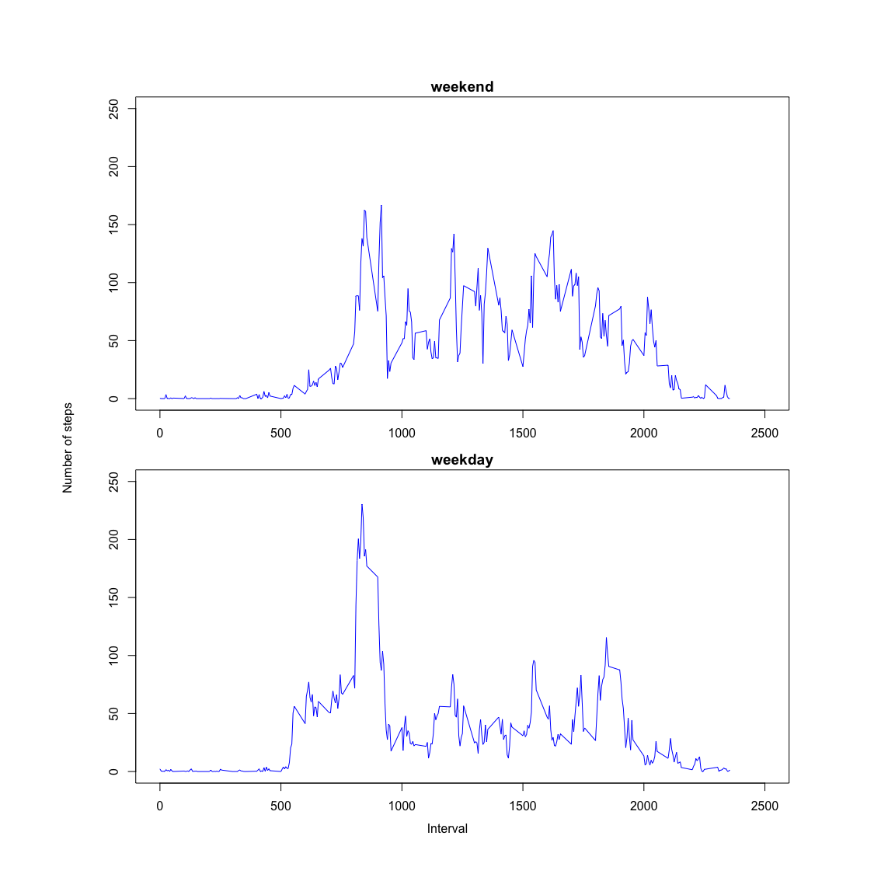

# Reproducible Research: Peer Assessment 1


## Loading and preprocessing the data

```r
raw_data <- read.csv("../../peer1/activity.csv", header = TRUE, sep = ",")
aggregate_data <- aggregate(steps ~ date, raw_data, as.vector, na.action = na.pass)
aggregate_data[, "total_daily"] <- 0
for (i in 1:nrow(aggregate_data)) {
  aggregate_data[i,]$total_daily <- sum(aggregate_data[i,]$steps)
}
```
## What is mean total number of steps taken per day?


```r
hist(aggregate_data$total_daily, xlab = "Total Daily Steps", main = "Histogram of total daily steps")
```

 

Mean daily steps: 10766
<br>
Median daily steps: 10765

## What is the average daily activity pattern?

```r
aggregate_data2 <- aggregate(steps ~ interval, raw_data, as.vector, na.action = na.pass)

aggregate_data2[, "average_by_interval"] <- 0
for (i in 1:nrow(aggregate_data2)) {
  aggregate_data2[i,]$average_by_interval <- mean(aggregate_data2[i,]$steps, na.rm = TRUE)
}

plot(aggregate_data2$interval, aggregate_data2$average_by_interval, ylim = c(0, 250), type = "l", main = "Average steps by interval", xlab = "Interval", ylab = "Average steps")
```

 
<br>
On average, maximum number of steps are taken in interval: 835
<br>

## Imputing missing values

Total rows with missing values : 2304
<br>
Missing values are replaced with the mean for the interval.
<br>


```r
clean_data <- raw_data
for (i in 1:nrow(clean_data)) {
  if (is.na(raw_data[i, ]$steps)) {
    clean_data[i, ]$steps <- aggregate_data2[(aggregate_data2$interval == clean_data[i,]$interval),]$average_by_interval
    
  }
}

aggregate_data3 <- aggregate(steps ~ date, clean_data, as.vector, na.action = na.pass)
aggregate_data3[, "total_daily"] <- 0
for (i in 1:nrow(aggregate_data3)) {
  aggregate_data3[i,]$total_daily <- sum(aggregate_data3[i,]$steps)
}


hist(aggregate_data3$total_daily, xlab = "Total Daily Steps", main = "Histogram of total daily steps")
```

 
<br>
New mean daily steps: 10766
<br>
New median daily steps: 10766


## Are there differences in activity patterns between weekdays and weekends?


```r
clean_data$day_type <- ""
levels(clean_data$day_type) <- c("Weekday", "Weekend")

weekend_days <- c("Saturday", "Sunday")

for (i in 1:nrow(clean_data)) {
#   if (weekdays(as.POSIXct(strptime(clean_data[i,]$date, "%Y-%m-%d"))) %in% weekend_days) {
#     clean_data[i,]$day_type <- "Weekend"
#   }
#   else {
#     
#     clean_data[i,]$day_type <- "Weekday"
#   }
testday <- weekdays(as.POSIXct(strptime(clean_data[i,]$date, "%Y-%m-%d"))) 
testdays <- character(0)
testdays <- c(testdays, testday)
clean_data[i,]$day_type <-   ifelse(testday %in% weekend_days, "Weekend", "Weekday")
testdays <- c(testdays, clean_data[i,]$day_type)
}

intervals <- unique(clean_data$interval)

aggregate_data4 <- read.csv(text = "", col.name = c("average_steps", "interval", "day_type"), colClasses = "character")

for (i in intervals) {
  weekday_mean <- mean(clean_data[((clean_data$day_type == "Weekday") & (clean_data$interval == i)),]$steps)
  weekend_mean <- mean(clean_data[((clean_data$day_type == "Weekend") & (clean_data$interval == i)),]$steps)
  aggregate_data4 <- rbind(aggregate_data4, data.frame(average_steps = weekday_mean, interval = i, day_type = "Weekday"))
  aggregate_data4 <- rbind(aggregate_data4, data.frame(average_steps = weekend_mean, interval = i, day_type = "Weekend"))

}

par(mfrow = c(2, 1), mar = c(2.5, 4.1, 1.5, 2.1), omi = c(1,1,1,1))

plot(aggregate_data4[aggregate_data4$day_type == "Weekend",]$interval, aggregate_data4[aggregate_data4$day_type == "Weekend",]$average_steps, type = "l", xlim = c(0,2500), ylim = c(0, 250), xlab = NA, ylab = NA, main = "weekend", col = "blue" )

plot(aggregate_data4[aggregate_data4$day_type == "Weekday",]$interval, aggregate_data4[aggregate_data4$day_type == "Weekday",]$average_steps, type = "l", xlim = c(0,2500), ylim = c(0, 250), xlab = NA, ylab = NA, main = "weekday", col = "blue")

mtext("Interval", side = 1, outer = TRUE)
mtext("Number of steps", side = 2, outer = TRUE)
```

 


